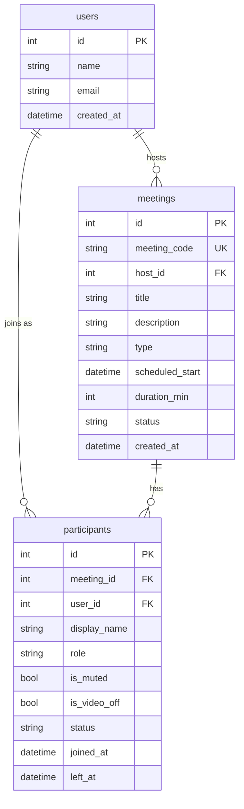

# Zoom Clone 📹

A fully functional web-based video conferencing application inspired by Zoom. This project implements real-time peer-to-peer video calls, meeting scheduling, host controls, and live chat, built with modern web technologies.

🔗 **[Live Demo](https://zoom-clone-pearl-seven.vercel.app/)**  
📖 **[Backend API Docs (Swagger)](https://zoom-clone-pearl-seven.vercel.app/api/docs)** *(Replace with actual Render URL if applicable)*

---

## 🚀 Features

- **Instant & Scheduled Meetings**: Start a meeting instantly with a unique shareable link or schedule it for later (with title, description, and date/time).
- **Real-Time Video/Audio**: Low-latency peer-to-peer mesh architecture for audio and video utilizing WebRTC.
- **Meeting Room Controls**: 
  - Toggle Microphone and Camera
  - Participants list with status tracking
  - Host Controls: Mute all participants, remove specific participants
- **Live Chat**: Group chat and direct messaging within the meeting room.
- **Dashboard**: View upcoming and recently attended meetings.
- **Easy Join**: Join a meeting via a unique meeting ID or a direct invite link. Includes existence validation and name entry.

---

## 🛠️ Tech Stack

### Frontend
- **Framework:** Next.js 16 (App Router)
- **Language:** TypeScript
- **Styling:** Tailwind CSS 4, Lucide React (Icons)
- **Hosting:** Vercel

### Backend
- **Framework:** FastAPI (Python)
- **Real-Time Communication:** WebSockets (FastAPI built-in)
- **Database:** SQLite with SQLAlchemy (ORM)
- **Data Validation:** Pydantic
- **Hosting:** Render

### Core Technologies
- **Video/Audio Streaming:** WebRTC (Peer-to-peer Mesh topology)
- **Signaling Server:** FastAPI WebSockets (Used to exchange ICE candidates and SDP offers/answers to establish WebRTC connections)

---

## 🧠 How It Works

1. **Signaling**: When a user joins a meeting room, a WebSocket connection is established with the FastAPI backend.
2. **Peer Discovery**: The backend notifies existing participants about the new user and vice versa.
3. **WebRTC Negotiation**: 
   - Browsers exchange SDP (Session Description Protocol) offers and answers via the WebSocket signaling server.
   - ICE (Interactive Connectivity Establishment) candidates are exchanged to discover the best direct network path between peers. (Note: Uses public STUN servers for NAT traversal).
4. **Peer-to-Peer Mesh**: Once negotiated, direct peer-to-peer WebRTC connections are established between every participant in the room for video and audio transmission.
5. **State Management**: Meeting state (participants, roles, muted status) is maintained in SQLite and broadcasted via WebSockets in real-time.

---

## 🗄️ Database Schema

The backend uses a relational database structure.



*Note: Indexes are placed on `meetings.meeting_code` and `meetings.scheduled_start` for quick lookups.*

---

## 🔌 Key API Endpoints

### REST API
- `GET /api/me`: Get current user info (seeded user).
- `POST /api/meetings/instant`: Create an instant meeting.
- `POST /api/meetings`: Schedule a new meeting.
- `GET /api/meetings/upcoming`: Fetch upcoming scheduled meetings.
- `GET /api/meetings/recent`: Fetch recent past meetings.
- `GET /api/meetings/{code}`: Get specific meeting details.
- `PATCH /api/meetings/{code}`: Update a meeting.
- `DELETE /api/meetings/{code}`: Delete a scheduled meeting.
- `POST /api/meetings/{code}/join`: Join a meeting.
- `POST /api/meetings/{code}/leave`: Leave a meeting.
- `GET /api/meetings/{code}/participants`: List participants in a meeting.
- `POST /api/meetings/{code}/mute-all`: (Host) Mute all participants.
- `DELETE /api/meetings/{code}/participants/{id}`: (Host) Remove a participant.

### WebSocket
- `ws://<backend-url>/ws/meetings/{code}`: WebSocket endpoint for WebRTC signaling and real-time chat/controls.

---

## 💻 Run Locally

### Prerequisites
- Node.js (v18+)
- Python (3.9+)

### Backend Setup
```bash
# Navigate to the backend directory
cd backend

# Create and activate a virtual environment
python -m venv venv
source venv/bin/activate   # On Windows use: venv\Scripts\activate

# Install dependencies
pip install -r requirements.txt

# Run the FastAPI server
uvicorn app.main:app --reload
```
The backend will run on `http://localhost:8000`. Swagger documentation is available at `http://localhost:8000/docs`.

### Frontend Setup
Open a new terminal window:
```bash
# Navigate to the frontend directory
cd frontend

# Install dependencies
npm install

# Create environment file
echo NEXT_PUBLIC_API_URL=http://localhost:8000 > .env.local

# Start the Next.js development server
npm run dev
```
The frontend will be available at `http://localhost:3000`.

---

## 📝 Notes & Assumptions

- **Authentication**: For demonstration purposes, there is no complex authentication; a default user is seeded into the database on startup.
- **Network Constraints**: The current WebRTC implementation uses STUN servers only. It might fail to establish direct P2P connections across highly restrictive enterprise networks/firewalls since no TURN server is provided.
- **Data Persistence**: If hosted on Render's free tier, the SQLite database resets on every server restart. Seed data is automatically generated upon restart to ensure the app remains functional for demo purposes.
- **Mock Data**: "Demo participants" might be injected into rooms for realism during testing.
